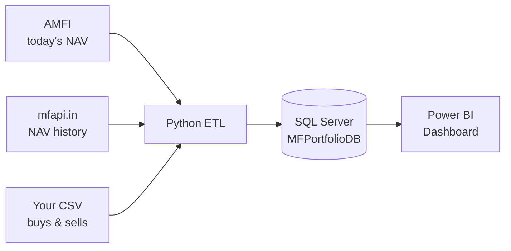

# Mutual Fund Portfolio Dashboard

Track your Indian mutual fund investments automatically.
Every day, this project downloads the latest NAV (Net Asset Value) of your funds,
stores it in SQL Server, and calculates how your portfolio is doing.

> 📖 **Read the full story:** [Case Study – how and why this project was built](docs/CASE_STUDY.md)

---

## What it does

| Feature | Description |
|---|---|
| Daily NAV download | Gets the latest NAV of all ~14,000 schemes from AMFI |
| Full NAV history | Loads every past NAV of your funds (10+ years) from mfapi.in |
| Fund search | Find a fund's SchemeCode by typing part of its name |
| Transaction import | Load your buys and sells from a simple CSV file, with safety checks |
| Automatic updates | Windows Task Scheduler runs the update every morning |
| Dashboard *(Step 7 – coming next)* | Power BI pages for Buy/Wait signals and portfolio performance |

---

## How it works



### Where the data comes from

| Data | Source | Used for |
|---|---|---|
| Latest NAV of every scheme | `https://portal.amfiindia.com/spages/NAVAll.txt` (AMFI, official) | Today's value of your funds |
| Past NAVs of one scheme | `https://api.mfapi.in/mf/<SchemeCode>` (free, unofficial) | Month-start NAV, buy-date NAV, charts |
| Your transactions | Your own CSV file (from your app or CAS statement) | Invested amount, units, gain/loss |

---

## Tech stack

- **Python 3.13** – pandas, requests, pyodbc
- **SQL Server 2022** (Developer edition, Windows Authentication)
- **Power BI Desktop** – dashboard
- **Windows Task Scheduler** – daily automation

---

## Project structure

```
mutual-fund-portfolio-dashboard/
├── sql/
│   ├── 01_create_database.sql        Step 1 - database + 3 tables
│   └── 02_fundmaster_add_details.sql Step 3 - extra fund columns
├── etl/
│   ├── db.py                         SQL Server connection settings
│   ├── http_utils.py                 downloads with automatic retry
│   ├── amfi_client.py                Step 2 - download today's NAV
│   ├── register_fund.py              Step 3 - search / add funds
│   ├── backfill_history.py           Step 4 - load past NAVs
│   ├── import_transactions.py        Step 5 - load buys & sells
│   └── daily_etl.py                  Step 6 - daily update
├── scripts/
│   └── schedule_daily_etl.ps1        Step 6 - Windows scheduled task
├── data/
│   └── sample_transactions.csv       example transactions file
├── docs/
│   └── CASE_STUDY.md                 project case study
├── requirements.txt
└── README.md
```

### Database tables

| Table | What goes in it |
|---|---|
| **FundMaster** | The funds you track (SchemeCode, name, fund house, category, buy threshold) |
| **NAVHistory** | One NAV per fund per day |
| **Transactions** | Your buys and sells (date, amount, NAV, units) |

---

## Setup – step by step

> All commands are run in **PowerShell**, inside the project folder.

### Before you start

You need these installed:

- [Python 3.11+](https://www.python.org/downloads/)
- [SQL Server](https://www.microsoft.com/sql-server/sql-server-downloads) (Developer or Express edition)
- [ODBC Driver 17 for SQL Server](https://learn.microsoft.com/sql/connect/odbc/download-odbc-driver-for-sql-server)
- [Power BI Desktop](https://powerbi.microsoft.com/desktop/) (for Step 7)

### Step 0 – Get the code and install Python libraries

```powershell
git clone <your-repo-url>
cd mutual-fund-portfolio-dashboard

# Create a private Python environment for this project
python -m venv .venv

# Install the libraries (requests, pandas, pyodbc)
.\.venv\Scripts\python.exe -m pip install -r requirements.txt
```

If your SQL Server is **not** called `NILU`, open [etl/db.py](etl/db.py) and change `SERVER = "NILU"`.

### Step 1 – Create the database and tables

```powershell
sqlcmd -S NILU -E -i sql\01_create_database.sql
sqlcmd -S NILU -E -i sql\02_fundmaster_add_details.sql
```

(Or open each `.sql` file in SSMS and press **F5**.)
Both scripts are safe to run again – they only create what is missing.

### Step 2 – Test the AMFI download

```powershell
.\.venv\Scripts\python.exe etl\amfi_client.py
```

You should see about 14,000 schemes and a CSV copy saved in `data\raw\`.

### Step 3 – Add your funds

```powershell
# Find the SchemeCode (type a few words of the fund name)
.\.venv\Scripts\python.exe etl\register_fund.py --search "parag parikh flexi"

# Add one or more funds
.\.venv\Scripts\python.exe etl\register_fund.py --add 122639 118989

# See what you are tracking
.\.venv\Scripts\python.exe etl\register_fund.py --list
```

> 💡 Each fund has several versions – **Direct / Regular** plan and **Growth / IDCW** option –
> each with its own SchemeCode and NAV. Pick the one on your account statement.

Optional: `--threshold -5` sets the Buy signal to "5% below month-start NAV" (default is -3%).

### Step 4 – Load past NAVs

```powershell
.\.venv\Scripts\python.exe etl\backfill_history.py
```

Loads the full NAV history of every fund you added. Safe to run again – only missing days are added.

### Step 5 – Load your transactions

```powershell
# 1. Copy the sample file and put your real transactions in it (Excel is fine)
Copy-Item data\sample_transactions.csv data\my_transactions.csv

# 2. Import
.\.venv\Scripts\python.exe etl\import_transactions.py data\my_transactions.csv

# 3. Check
.\.venv\Scripts\python.exe etl\import_transactions.py --list
```

CSV format:

| TxnDate | SchemeCode | TxnType | Amount | NAV | Units | Notes |
|---|---|---|---|---|---|---|
| 2024-01-05 | 122639 | BUY | 10000 | *(blank)* | *(blank)* | Lump sum |

- **NAV blank** → looked up automatically (holiday → next working day's NAV)
- **Units blank** → Amount ÷ NAV (type the exact units from your statement if you have them)
- If **any** row has a problem, **nothing** is saved and you get a clear list of what to fix
- Importing the same file twice does **not** create duplicates
- `data/my_transactions.csv` is in `.gitignore`, so your real investments never go to GitHub

### Step 6 – Turn on the daily update

```powershell
# Run once by hand
.\.venv\Scripts\python.exe etl\daily_etl.py

# Schedule it every day at 9:00 AM
powershell -ExecutionPolicy Bypass -File scripts\schedule_daily_etl.ps1
```

Useful commands:

```powershell
Get-ScheduledTaskInfo -TaskName "MF Portfolio Daily ETL"      # LastTaskResult 0 = success
Start-ScheduledTask   -TaskName "MF Portfolio Daily ETL"      # run it now
Get-Content logs\daily_etl_<yyyyMMdd>.log                     # read the log
powershell -ExecutionPolicy Bypass -File scripts\schedule_daily_etl.ps1 -Remove   # turn off
```

### Step 7 – Power BI dashboard *(coming next)*

Planned pages:

- **Buy Opportunity** – latest NAV vs month-start NAV, change %, BUY / WAIT signal
- **Portfolio Performance** – invested, current value, gain/loss, return %, allocation by AMC and category

---

## Troubleshooting

| Problem | Fix |
|---|---|
| `www.amfiindia.com` times out | Already handled – the project uses `portal.amfiindia.com` |
| `Login timeout expired` from SQL Server | Check the SQL Server service is running; try again (the connection waits 60 s) |
| `SchemeCode ... is not in FundMaster` | Add the fund first with `register_fund.py --add <code>` |
| `no NAV found on/after <date>` | Run `backfill_history.py`, or type the NAV in the CSV |
| Scheduled task stays **Queued** on a laptop | Re-run `schedule_daily_etl.ps1` – it allows running on battery |
| Excel changed dates to `05-01-2024` | Format the column as text `2024-01-05`, save as **CSV UTF-8** |

---

## Credits

- Inspired by [VishalS255/Mutual-Fund-Investment-Analytics](https://github.com/VishalS255/Mutual-Fund-Investment-Analytics)
- NAV data: [AMFI India](https://www.amfiindia.com/) and [mfapi.in](https://www.mfapi.in/)

> ⚠️ This project is for personal tracking and learning. It is not investment advice.
