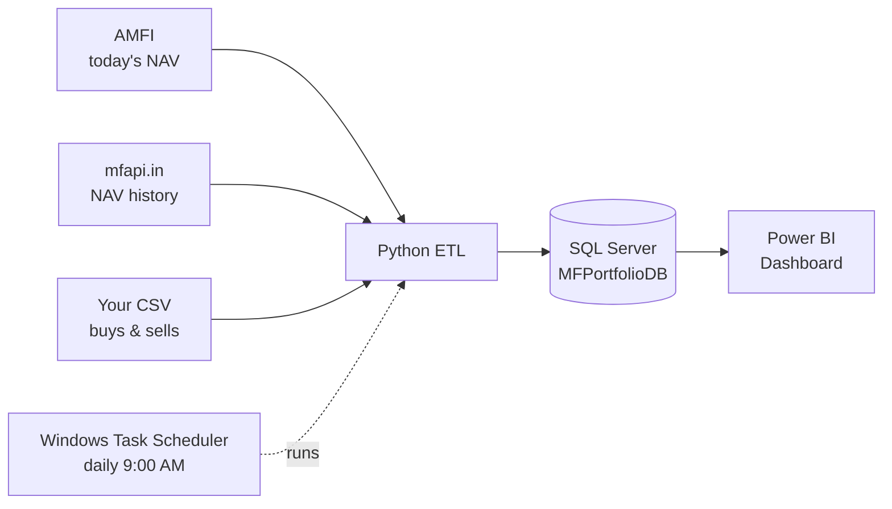
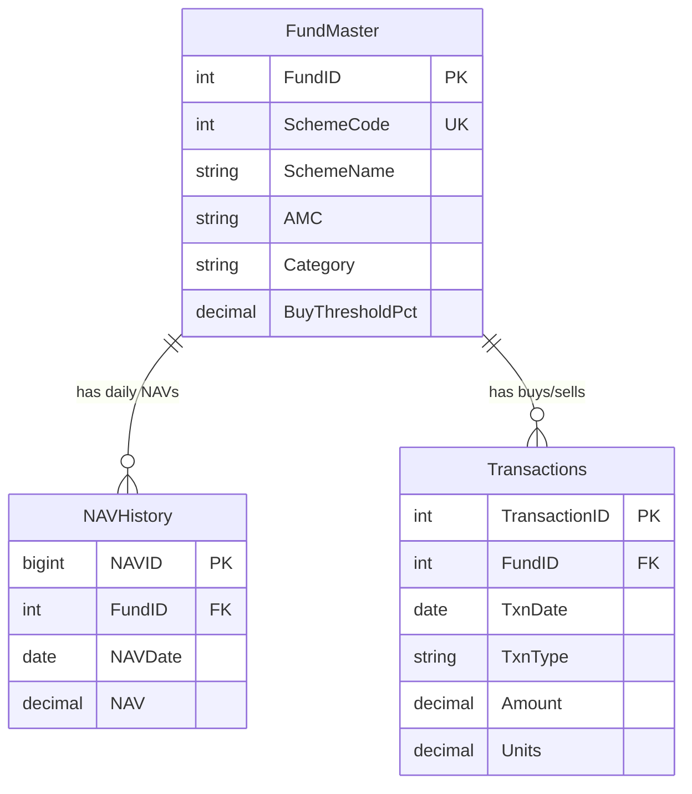

# Case Study: Mutual Fund Portfolio Dashboard

*An automated pipeline that tracks Indian mutual fund investments – from raw public data to a SQL Server database ready for Power BI.*

← [Back to README](../README.md)

---

## 1. The problem

Many people in India invest in mutual funds through several apps and fund houses.
Answering simple questions then becomes hard work:

- *How much have I invested in total, and what is it worth today?*
- *Which fund has dropped this month – is it a good time to buy more?*
- *How is my money split across fund houses and categories?*

Doing this by hand means copying NAVs from websites into a spreadsheet every day.
It is slow, easy to get wrong, and most people simply stop doing it.

## 2. The goal

Build a small system that:

1. **Collects** NAV data automatically every day – no manual copying
2. **Stores** full history in a proper database, not a spreadsheet
3. **Checks** transaction data so mistakes are caught before they are saved
4. **Feeds** a dashboard with Buy/Wait signals and portfolio performance

The project was inspired by
[VishalS255/Mutual-Fund-Investment-Analytics](https://github.com/VishalS255/Mutual-Fund-Investment-Analytics)
and rebuilt from scratch, step by step.

## 3. Data sources

| Source | What it gives | Why it was chosen |
|---|---|---|
| **AMFI** `NAVAll.txt` | Latest NAV of every scheme in India (~14,000) | Official, free, updated every evening |
| **mfapi.in** | Full NAV history of one scheme as JSON | Free, no API key, history back to 2013 |
| **Your CSV** | Your own buys and sells | Simple – works with any app or CAS statement |

The **AMFI SchemeCode** is the key that joins all three together.

## 4. Solution design

### Database model

Rules built into the database:

- One NAV per fund per day (`UNIQUE (FundID, NAVDate)`) – reloading can never create duplicates
- `TxnType` must be `BUY` or `SELL`; amount, NAV and units must be above 0

### The pipeline, step by step

| Step | Script | What it does |
|---|---|---|
| 1 | `sql/01_create_database.sql` | Creates the database and 3 tables |
| 2 | `etl/amfi_client.py` | Downloads and cleans AMFI's daily file |
| 3 | `etl/register_fund.py` | Search funds by name and add them |
| 4 | `etl/backfill_history.py` | Loads full NAV history from mfapi.in |
| 5 | `etl/import_transactions.py` | Imports and checks buys/sells from CSV |
| 6 | `etl/daily_etl.py` + scheduled task | Keeps everything up to date every day |
| 7 | Power BI *(in progress)* | Buy Opportunity and Portfolio Performance pages |

## 5. Challenges and how they were solved

Real problems found while building and testing this project:

| # | Challenge | What happened | Solution |
|---|---|---|---|
| 1 | **AMFI website unreachable** | `www.amfiindia.com` timed out on our network, while other sites worked | Tested the connection host by host and found `portal.amfiindia.com` serves the same file |
| 2 | **AMFI file is not a real CSV** | Fund house and category are *heading lines*, not columns; the file format has 8 columns | Read the file line by line, remember the last heading, attach it to each scheme row |
| 3 | **Broken characters** | Names like *Children's Fund* showed as `Children’s` | Force UTF-8 decoding of the download |
| 4 | **SQL reserved words** | Columns named `Plan` and `Option` failed – both are reserved words in SQL Server | Renamed to `PlanType` and `OptionType` |
| 5 | **Buying on a holiday** | A SIP dated 26-Jan (Republic Day) has no NAV | Use the next working day's NAV, like fund houses do (26-Jan → 29-Jan) |
| 6 | **History source lags** | mfapi.in history ended 5 days before AMFI's latest date | Daily job uses **both**: mfapi.in to catch up gaps, AMFI for the latest day |
| 7 | **Random timeouts** | mfapi.in sometimes timed out and failed the whole run | Automatic retry (wait 5 s, then 10 s). Seen working in a real run |
| 8 | **Selling more than you own** | A typing mistake could record a sale bigger than your holding | Check units held on that date; if any row fails, **nothing** is saved |
| 9 | **Scheduled task never ran** | Task stayed *Queued* – the laptop was on battery, and Windows skips tasks on battery by default | Allow start on battery; also *run as soon as possible* if the PC was off at 9:00 |

## 6. Results

Measured while testing on a real machine (SQL Server 2022, Windows 11):

| Check | Result |
|---|---|
| Schemes parsed from AMFI's daily file | **14,153** schemes, 54 fund houses, 101 categories |
| History for one fund (Parag Parikh Flexi Cap) | **3,275 days** (May 2013 – Sep 2026) loaded in about 4 s |
| Full daily update for 2 funds | about **6 s** |
| Re-running any load | **0 duplicates** |
| Bad transaction rows (wrong date, unknown fund, wrong type, negative amount, oversell) | All caught with a clear message, nothing saved |

## 7. What I learned

- **Public data is messy.** Most of the work was understanding the data format, not writing SQL.
- **Make every step safe to re-run.** Every script skips data that already exists, so a failed run can simply be repeated.
- **Check first, save later.** Checking every row before saving anything keeps the database trustworthy.
- **Test the automation, not just the code.** The scheduled task looked fine but never ran – only a real test showed the battery problem.
- **Keep code readable.** Every script is written as numbered steps with comments, so it is easy to follow later.

## 8. Next steps

- [ ] **Step 7:** SQL views (latest NAV, month-start NAV, holdings) and the Power BI dashboard
- [ ] Import transactions directly from a CAS PDF statement
- [ ] Add XIRR (annualised return) per fund and for the whole portfolio
- [ ] Email or phone alert when a fund reaches its Buy threshold

---

← [Back to README](../README.md)
